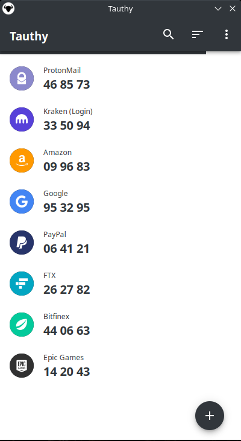
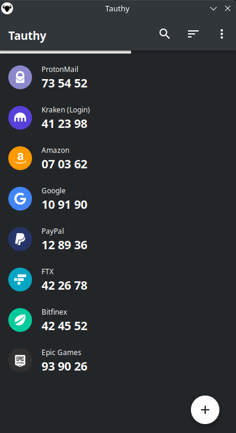
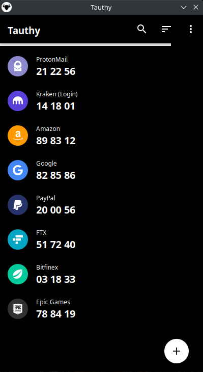

<h1 align="center">
  
   
  
Tauthy

</h1>

<h3 align="center">
A cross-platform TOTP authentication client built with <a href="https://github.com/tauri-apps/tauri">tauri</a>.
</h3>

  

## Features

- modern UI
- cross-platform
- secure storage
- password protection
- import / export
- multi-language
- all your favorite themes

## Screenshots

  
  
  

## Todo

- [ ] support Yubikey
- [ ] support other import files
- [ ] multi-language
- [ ] add more standard themes (Solarized etc.)

## Credits

- [Aegis](https://github.com/beemdevelopment/Aegis)
- [Tauri](https://tauri.studio)
- [TimDumol/rust-otp](https://github.com/TimDumol/rust-otp)

## License

GPL-3.0 License. See [License](./LICENSE).
