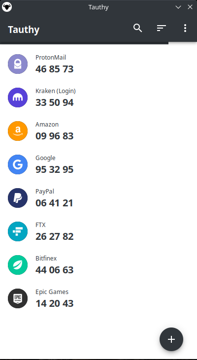
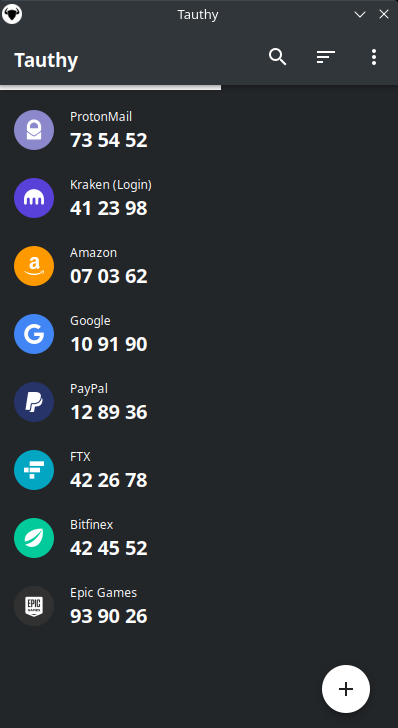
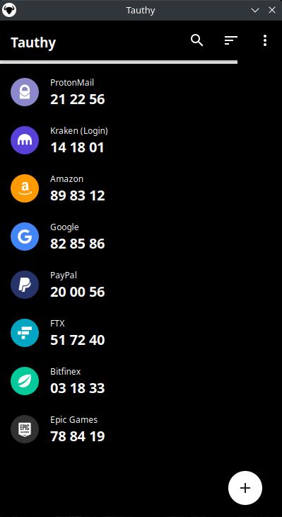

<h1 align="center">
  
   
  
Tauthy

</h1>

<h3 align="center">
A fast, private, local-first desktop authenticator that stays out of your way.
</h3>

  

## Screenshots

  
  
  

## Features

**Thoughtful defaults keep everyday authentication quick and uncomplicated.**

- **Private and offline:** Your authentication secrets stay on your device, and codes work without
  an internet connection.
- **Secure local vault:** Add password protection and automatically lock Tauthy when it is idle.
- **Ready when you need it:** Search, arrange, and recognize accounts at a glance, then copy a code
  with one click.
- **Easy migration:** Bring existing accounts with you, display transfer QR codes, and create
  portable backups.
- **At home on your desktop:** Runs on macOS, Windows, and Linux with automatic updates,
  system-aware themes, four languages, and a true black mode.

## Security & Privacy

Tauthy stores authentication secrets locally in an encrypted vault. No cloud account is required,
and code generation works offline. You can add password protection and automatic idle locking for
additional protection.

Password-protected backups are encrypted locally and are the recommended way to keep a portable
copy. Plain JSON exports remain available for interoperability and should be stored securely and
deleted when no longer needed. The formats are documented in
[Tauthy backup format v1](./docs/tauthy-backup-v1.md) and
[Tauthy encrypted backup format v1](./docs/tauthy-encrypted-backup-v1.md).

## Installation

[Download](https://github.com/pwltr/tauthy/releases/latest) or [Build it from source](./Build.md).

### Upgrading from 0.2.8 or earlier

Export a backup before upgrading. Tauthy 0.3 migrates the encrypted vault to the current Stronghold
format on the first successful unlock. Until that unlock, the vault remains protected by the legacy
password derivation. The migration is one-way: Tauthy 0.2.8 and earlier cannot open the migrated
vault, so restoring an older release also requires restoring the exported backup.

## Credits

The name **Tauthy** combines [Tauri](https://tauri.app), the framework it is built with, and
authenticator.

- [Aegis](https://github.com/beemdevelopment/Aegis)
- [aegis-icons](https://github.com/aegis-icons/aegis-icons)
- [Tauri](https://tauri.app)

## Support

## License

GPL-3.0 License. See [License](./LICENSE).
